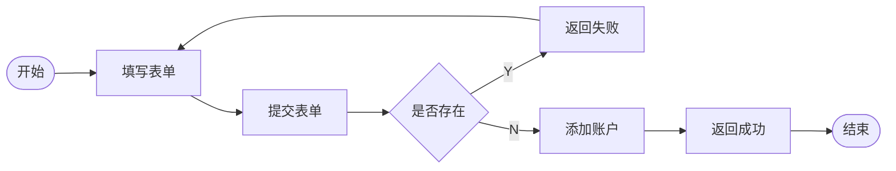
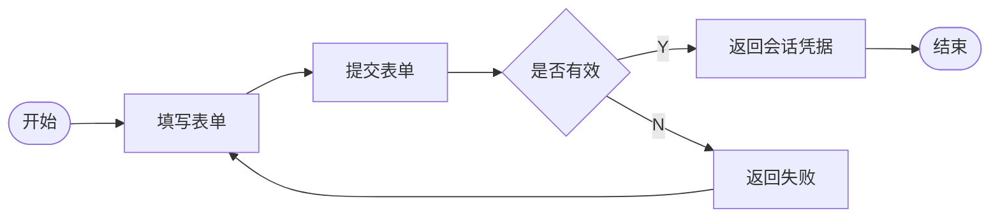
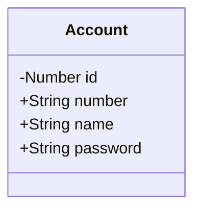

# 注册登录

对于大多数网络服务来说，用户认证几乎是最基础的功能之一，我们的项目也将从实现注册登录的功能开始。

## 概念

* 用户: 准确的说，用户是使用该软件的人，有时候也会指代用户使用软件时借助的账户。
* 账户: 账户是用户使用软件过程中的身份的载体，用户通常需要现在软件中登记一个账户，账户通常使用一串字符和数字组成的账号进行标识。所以有的时候也会混用账号和账户的概念。
* 账号: 账号是账户的唯一索引，也就是说我们会使用账号来区分不同的账户，所以有的时候也会使用账号指代账户。
* 注册：注册是注册账户的简称，也就是在软件中新增一个账户，有的时候也会称谓登记账户或开设账户。
* 登录: 用户在使用账号进行业务之前，需要先跟服务器建立会话，登录也就是建立会话的过程，这个过程中，用户需要使用账户的登录凭据，证明自己是账户的所有者，通常使用账户名和账户密码作为凭据进行的登陆。

## 需求分析

### 注册

注册是新增账户的过程，用户通过在注册页面填写账户信息并提交，通知软件执行新增账户的过程，账户注册返程会，软件返回注册的结果给用户。

### 登录

登录是用户使用账户凭据证明身份并建立会话的过程，用户填写登录表单，提交登录凭据，软件验证登录凭据，如果有效则返回会话凭据，随后用户使用会话凭据使用软件的功能。

## 技术方案

### 模型

### 前端

使用TypeScript建立账户模型，使用ElementPlus创建注册登录表单，使用Axios实现Rest客户端。

### 后端

使用SpringSecurity实现登录注册接口，使用SpringDataJPA持久化账户信息，使用SpringSession处理会话。
账户ID使用服务器自增主键，number使用雪花算法创建，name为用户设置账户名，可以使用手机号码或邮件地址等标识，也可以使用方便记忆的字符串，name不允许重复，password是用户设置的证明凭据，不应该保存明文。