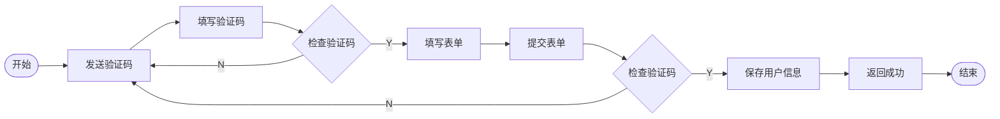
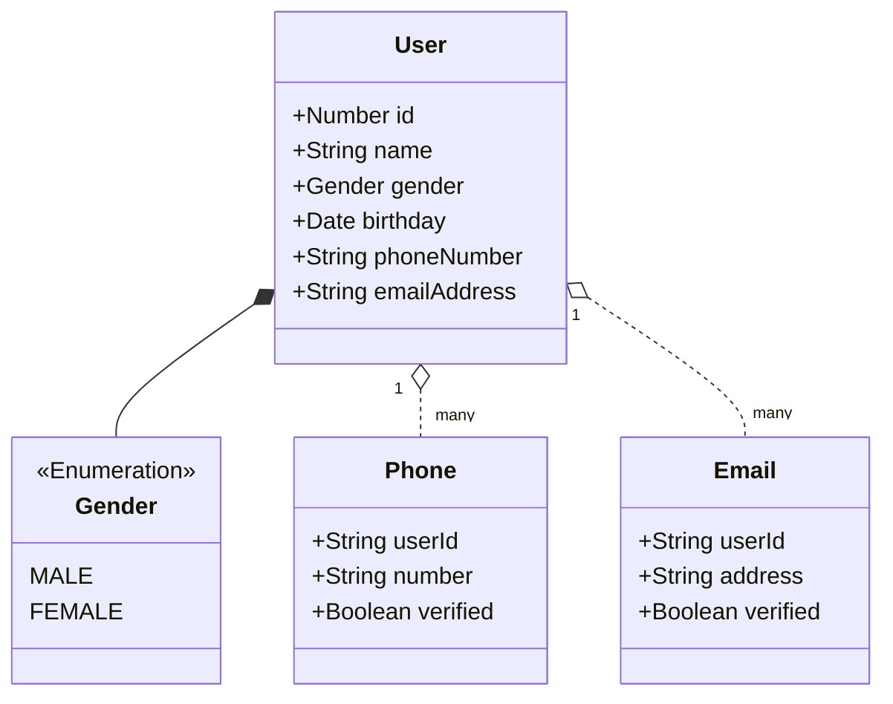

# 用户管理

在之前的身份认证的过程中，用户是使用账户信息作为登录凭证证明身份的，也就是使用账户名和密码进行登录。在解决了证明我是我的问题后，接下来就需要处理我是谁的问题，也就是登记用户信息。在很多软件中，通常把登记账户和登记用户合并成一个过程，在我看来，这样虽然可以缩短操作的过程，但是一下子让用户填写一大堆信息，确实给用户注册账号增加了巨大的阻力。所以我更倾向与让用户先登记账户，然后在登记用户信息。

## 概念

关于用户和账户的概念，可以阅读[V0.1_注册登录](./V0.1_%E6%B3%A8%E5%86%8C%E7%99%BB%E5%BD%95.md)。

* 用户名: 用户名是用户登记的用于让别人称呼自己的名称，是可以有限制的修改的，在有些系统中用户名也叫做昵称。
* 绑定手机号：现代互联网应用中，通常会要求用户验证手机号码，一来是防止用户恶意注册大量账户，二来可以为用户提供除用户名密码外其他的验证方式。
* 绑定电子邮件地址：除了绑定手机号，也可以通过绑定电子邮件地址的方式对用户进行验证，单电子邮件的验证效果更佳有限，通常注册电子邮件的成本并不高，用户可以轻易的注册大量的电子邮件。

## 需求分析

### 登记用户信息

注册是新增账户的过程，而登记用户信息则是验证用户的过程，通过登记必要的信息在一定程度上确认用户的身份，为用户在以后的使用中提供一定的信息基础。

## 技术方案

### 模型

### 短信验证码

这里我们只实现一个伪造的短信服务，实际的短信服务可以使用不同短信服务商的SDK进行适配。

### 登记表单

* 【输入框】用户名
* 【单选框】性别 （默认值为不便透露，否则选择男或女）
* 【日期选择器】生日（不填写则为null）
* 【输入框】手机号码
* 【输入框】验证码 （输入验证码到达指定位数后自动发送验证请求并显示验证结果）
* 【输入框】电子邮件地址（登记过程不会验证电子邮件地址，这里仅仅做记录，登记后可以到用户主页进行验证）
* 【按钮】提交

## 开发计划

| 版本   | 功能         | 计划中 | 开发中 | 已完成 |
| ------ | ------------ | ------ | ------ | ------ |
| v0.2.0 | 登记用户信息 |        | x      |        |
| v0.2.1 | 个人主页     | x      |        |        |
| v0.2.2 | 用户管理     | x      |        |        |

